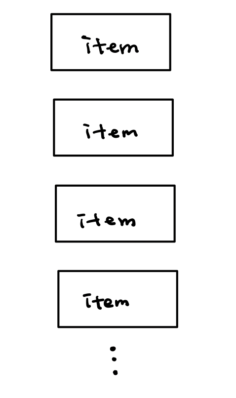
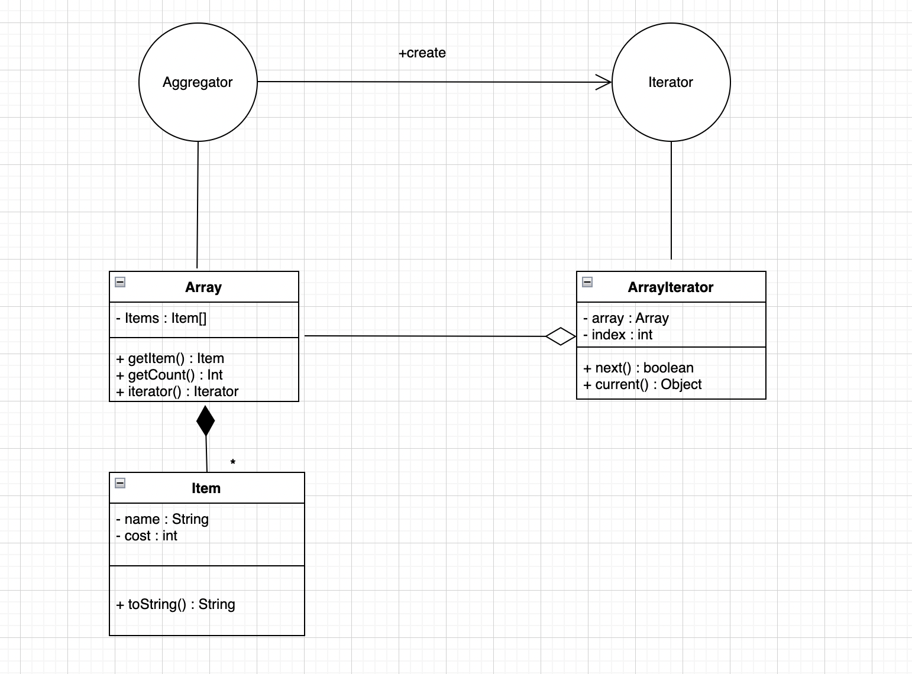
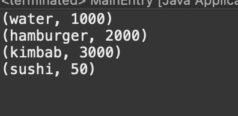

<br>

<br>

# 이터레이터 패턴이란

<br>

<br>

이터레이터 패턴(iterator pattern)은 이터레이터(iterator)를 사용하여 컬렉션(collection)의 요소들에 접근하는 디자인 패턴이다. 이를 통해 순회할 수 있는 여러가지 자료형의 구조와는 상관없이 이터레이터라는 하나의 인터페이스로 순회가 가능하다.

<br>

<br>

# Container/Aggregator/Colloection

<br>

<br>

그럼 이터레이터가 컬렉션의 요소를 접근한다? 이게 무슨 말일까 이를 자세하게 알아보자

<br>

<br>

 

<br>

<br>

**위와 같이 동일 데이터들의 집합**을 Collection이라고 한다. 대부분 이를 Container, Aggregator이라고 하는데 이 포스팅에서는 이런 집합을 Aggregator 라고 계속 표현하겠다.  즉, 이 세 단어는 거의 뜻이 비슷하다고 보면 된다!

<br>

<br>

# Container/Aggregator 의 종류

<br>

<br>

* Array -  배열 수 만큼 인덱스 번호로 가져오면 된다

* Linked List - 첫번째 데이터를 통해 다음 연결 데이터를 가져온다. 이를 뒤에 데이터가 없을 때 까지 반복한다.

* Tree

* Graph

* Table(DBMS) 

<br>

<br>

이렇듯, Aggregator에 따라 하나하나 들고오는 방법이 다 다르다. 이를 통일된 방법으로 구성데이터를 가져오기 위한 디자인 패턴이 Iteraor 이다.

<br>

<br>

# Iterator 패턴의 클래스 다이어그램

<br>

<br>

클래스 다이어그램이란 클래스 간 관계를 정의한 다이어그램으로, UML에서 정의한 다이어그램 중 하나다. Iterator 패턴은 클래스 간 관계가 면밀하기 때문에 이를 바탕으로 이해하는 것이 좋아보인다.

<br>

<br>

 

<br>

<br>

먼저, 도형들 부터 살펴보자

위에 원형은 Interface이다. 그리고 사각형 모양 표들은 Class 이다 

Interface는 클래스와 비슷하지만 차이점은 **메서드의 실제 구현 코드는 없고 단지 메서드의 형태만 선언되어 있는 것이다.**

이제 선들을 살펴보자

선들은 인터페이스와 클래스의 관계를 나타내준다.

1. Aggregator와 Iteraor를 연결 해주는 화살표 선 :  Aggreagtor 인터페이스 객체가 Iterator 인터페이스 객체를 **생성해준다.**

2. Aggregator와 Array 사이의 직선 : Aggregator 인터페이스 메서드의 내용을 Array 클래스에서 구현한다 

3. Iterator와 ArrayIterator 사이의 직선 : 2번과 동일하게 Iterator 인터페이스의 메서드 내용을 ArrayIterator에서 구현한다는 뜻이다.

4. Array와 ArrayIterator 사이의 마름모꼴 꼭짓점 직선 : ArrayIterator의 클래스에서 Array객체를 필드로 갖는다는 뜻

5. Array와 Item 사이의 채워진 마름모꼴 꼭짓점 직선 : Array 클래스에서 Item 객체를 필드로 갖는다. 이 때 별표는 Array 클래스가 Item객체를 여러개 가진다는 뜻이다.

마름모꼴 모양의 경우 소유를 나타낸다고 보면 된다. 마름모는 즉 **그릇**이다. 그릇에 객체를 담아준다고 생각하면 easy ~~ 즉, 다이아 있는 쪽이 소유주!

 채워짐과 안채워짐의 차이는 생명주기인데, 채워져있으면 생명주기를 같이 한다는 것이고 안채워져있다면 별도의 생명주기를 갖는다는 것이다. (소멸과 생성이 같다 예를 들어 Array 객체가 메모리에서 사라지면 Item객체들도 메모리에서 함께 소멸된다. 반면, ArrayIterator 객체가 소멸되도 노상관이라는 뜻)

<br>

<br>

# Iterator 클래스 다이어그램 분석

<br>

<br>

Iterator 관점에서 한 번 보자.

Aggregator와 Iterator 인터페이스가 Aggregator 구성 데이터를 하나씩 가져올 수 있는 통일된 인터페이스이다.

그리고 Array, ArrayIterator 클래스는 Iterator 패턴을 적용하기 위에 앞서 본 Aggregator 의 종류 중 배열이라는 자료구조에 특화된 클래스들이다. 즉, 배열 클래스들 

Item 클래스는 Aggregator의 구성 타입이다. 

<br>

<br>

# Iterator 패턴 코드1 - Aggregator(interface)

<br>

<br>

```java
public interface Aggregator {
    Iterator iterator(); //이터레이터 객체를 생성해서 반환해주는 메서드 

}
```

<br>

<br>

코드의 경우, 클래스 단위로 설명한다.

다이어그램에서 살펴봤듯이, Aggregator 인터페이스는 Iterator 객체를 생성해준다. 위의 Iterator() 메서드가 Iterator 객체를 반환해주는 메서드다.

<br>

<br>

# Iterator 패턴 코드2 - Iterator(interface)

<br>

<br>

```java
public interface Iterator {
    boolean next(); //다음구성을 얻을 수 있도록 함 구성얻을 수 있으면 true 
    Object current(); //구성데이터의 하나 반환, Type이 지정되지 않아야 하므로 Object로 선언 
}
```

<br>

<br>

next 메서드는 Iterator 메서드를 통해 다음 구성 데이터를 얻을 수 있도록 한다. 다음 구성 데이터가 얻을 수 있다면 true , 없으면 false

current 메서드는 구성데이터 하나를 반환시키는데, 이 때 Type이 지정되지 않아야하므로 Object 자료형을 써주었다.

<sub> 왜 Object 자료형을 썼을까? 위에서 설명했듯이 많은 Iterator 패턴을 적용할 수 있는 많은 자료구조들이 있다. 배열, 트리, 등등.. 무엇에든 쉽게 적용시키기 위해 이와 같이 Object 자료형으로 선언해준것이다.</sub>

<br>

<br>

# Iterator 패턴 코드3 - Item(class)

<br>

<br>

```java
public class Item { //Aggregate 구성 데이터 타입 클래스
    private String name;
    private int cost;

    public Item(String name,int cost) {
        this.name = name;
        this.cost= cost;
    }

    @Override
    public String toString() { //Item 객체 자체를 문자열 변환 시 자동으로 호출되는 메서드 
        return "("+name+", " + cost + ")";
    }

}
```

<br>

<br>

Aggregate의 구성 데이터의 대한 데이터 타입인 Item 클래스이다. 이름과 가격 필드가 있고, 생성자를 통해 이 두 값을 지정하고 있다. 문자열을 지정해주는 toString() 메서드를 재정의시켜줬다. 

<sub> toString() 이란 ? 이 Item 객체 자체를 문자열로 변환할 때 자동으로 호출된다 ex) System.out.print(Item);</sub>

<br>

<br>

# Iterator 패턴 코드4 - Array(class)

<br>

<br>

```java
public class Array implements Aggregator{
    private Item[] items;

    public Array(Item[] items) {
        this.items = items;
    }

    public Item getItem(int index) {
        return items[index];
    }

    public int getCount() {
        return items.length;
    }

    @Override
    public Iterator iterator() {
        return new ArrayIterator(this);  
    }

}
```

<br>

<br>

Aggregator interface를 구현한 배열 자료구조를 위한 Array 클래스이다. 

Aggregate interface를 implement를 해주었고 Array 클래스가 관리할 배열 데이터를 참조할 필드를 선언하였다(private Item[] items;)

이 items 필드에 대한 구성 데이터는 생성자를 통해 받도록 한다. (public Array(Item[] items))

그리고 배열 인덱스를 통해 구성 데이터를 얻을 수 있는 getItem() 메서드가 있고, 

배열 구성 데이터의 갯수를 구할 수 있는 getCount() 메서드가 있다. 

getItem()과 getCount()메서드는 Iterator 인터페이스를 구현한 ArrayIterator 클래스에서 사용된다.

그리고 인터페이스를 구현해야하므로(Aggregator) 이를 오버라이드 해주어서 구현해준다(iterator())

iterator() 메서드를 보면 ArrayIterator 객체를 생성해서 넘겨주는데, 생성 시 this를 인자로 하여 즉, 자기 자신 클래스인 Array 클래스를 매개변수로 넘겨준다.

<br>

<br>

# Iterator 패턴 코드5 - ArrayIterator(class)

<br>

<br>

```java
public class ArrayIterator implements Iterator{
    private Array array;
    private int index;

    public ArrayIterator(Array array) {
        this.array = array;
        this.index=-1;
    }

    @Override
    public boolean next() {
        index++;
        return index<array.getCount(); //배열의 인덱스 값으로 유효한지 반환 
    }

    @Override
    public Object current() {
        // TODO Auto-generated method stub
        return array.getItem(index);
    }


}
```

<br>

<br>

이 클래스는 Iterator 인터페이스를 구현한다. 

그리고 Array의  클래스를 필드로 참조한다. (private Array array;)

배열의 반환 가능한 데이터 항목의 인덱스를 위한 필드를 추가한다.(private int index;)

생성자의 경우 참조할 aggregate클래스 즉, array 클래스를 매개변수로 받아와서 현재 클래스의 필드에 설정한다. 그리고 현재 가르키고 있는 인덱스를 -1로 지정한다.(public ArrayIterator(Array array)...이하 생략)

Iterator 인터페이스 클래스에 있는 메소드를 구현해야한다. 

먼저, next() 의 경우 호출되면 index 값을 한 개 증가시키고, 이 인덱스 값이 배열 길이를 초과하지 않는지 즉! 유효한지를 boolean 형태로 반환한다. 배열길이의 경우 Aggregate인 Array 클래스의 getCount() 메서드를 통해 이루어지는데, 이 메서드의 경우는 Array의 items 배열의 길이를 반환해준다 

그 후 current() 메서드를 구현한다.이 또한 Aggretagte 객체인 array 클래스의 getItem()를 통해 반환한다. array 클래스의 getItem()는 현재 인덱스값의 구성데이터 개체를 반환시킨다 

<br>

<br>

# Iterator 패턴 코드6 - MainEntry Class

<br>

<br>

```java
public class MainEntry {
     public static void main(String[] args) {
        Item[] items = {
                new Item("water",1000),
                new Item("hamburger",2000),
                new Item("kimbab",3000),
                new Item("sushi",50)
        };

        Array array = new Array(items);
        //ArrayIterator가 아닌 array클래스에서 ArrayIterator 객체를 생성한다 
        Iterator it = array.iterator();

        while(it.next()) {
            Item item = (Item) it.current();
            System.out.println(item);
        }
    }
}
```

<br>

<br>

구성 요소가 담긴 item 배열을 추가해준다. (Item[] items... 이하 생략)

이 아이템들을 array 객체에 넣어준다. (Array array = new Array(items);) 이 때, 생성자에는 items 객체를 넘겨준다.

이 array 객체를 통해 반복자를 생성한다. (Iterator it = array.iterator();)

그 후 구성 데이터를 얻어와서 출력한다. 

먼저, while(it.next())를 통해 다음 데이터를 얻을 수 있는지의 여부를 확인한다.

그리고 조건이 충족되면 it.current() 메서드를 통해 실제 데이터를 얻어오고 해당 자료형으로 형변환을 시켜준다. 그리고 이를 출력해준다

<br>

<br>

**여기서 중요한 점은 위의 Main문에서 ArrayIterator는 어디에서도 나오지 않았다는 것**이다. Array 클래스에서 ArrayIterator 객체를 생성하였고, Iterator 클래스를 통해 객체들에게 접근을 하고 있다는 것이다. 

**이는 ArrayIterator에 의존적이지 않다는 것**이다. 하나의 클래스를 수정하더라도 다른 클래스에게 영향을 끼치지 않는다. ArrayIterator가 그저 올바른 Iterator를 반환하기만 하면 되는 것이다. 만약 이를 배열이 아닌 Tree로 바꾼다면, **이 ArrayIterator 클래스만 수정하면 끝이라는 점이다.**

또한, 이는 캡슐화가 잘되어 있다는 것이다. 이 Main문이 예를 들어, 고객이라고 하자. 고객은 이러한 것을 어떻게 구현하였는지 알 필요가 없다(왜냐면 영업비밀이니까..ㅎㅎ) 고객은 Iterator만 알면되는 것이다. 이렇게 내부적 구현을 노출 시키지 않고 집합체의 모든 항목에 접근 할 수 있다는 것이다. 

# 실행 결과

<br>

<br>

 

<br>

<br>

데이터들이 잘 출력된다.

<br>

<br>

# 정리

<br>

<br>

Iterator 패턴의 핵심은 Array,Linked List, Tree 등과 같은 다양한 형태의 Aggregator 구성 요소를 참조할 수 있는 표준화 할 수 있는 공통 API 제공이 가능하다는 점이다.

이는 표준화된 한 개의 공통 API 만으로 다양한 데이터의 구조를 파악하지 않고도 구성데이터를 참조할 수 있다는 것이다.


<br>

<br>

<sub> 출처 : 면접을 위한 CS 전공지식 노트 , [GIS DEVELOPER](https://www.youtube.com/@gisdeveloper) 님 유튜브 강의 </sub>
